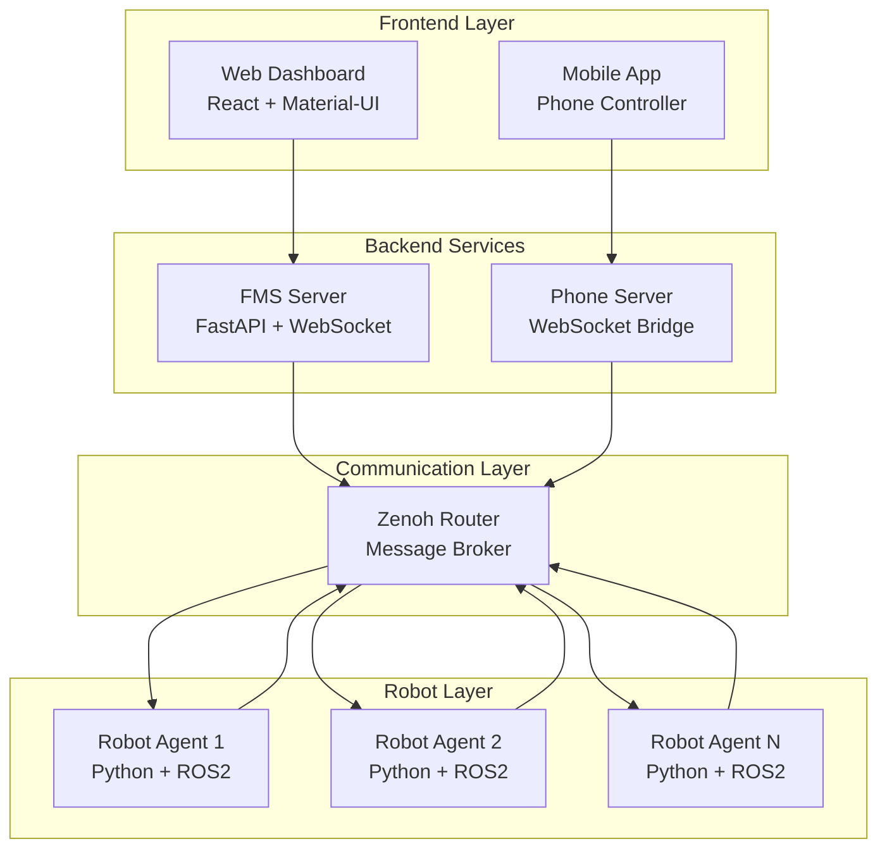

# Fleet Management System (FMS)

A comprehensive robotic fleet management system that enables real-time monitoring, control, and task scheduling for multiple robots. The system uses Zenoh for distributed messaging and provides both web and mobile interfaces for robot management.

## 📋 Table of Contents

- [Overview](#overview)
- [Architecture](#architecture)
- [Components](#components)
- [Quick Start](#quick-start)
- [Installation](#installation)
- [Configuration](#configuration)
- [API Documentation](#api-documentation)
- [Development](#development)
- [Deployment](#deployment)
- [Troubleshooting](#troubleshooting)

## 🎯 Overview

FMS is designed to manage and coordinate fleets of autonomous robots in various environments. It provides:

- **Real-time monitoring** of robot status, position, and battery levels
- **Task scheduling and dispatch** to available robots
- **Web-based dashboard** for fleet visualization and control
- **Mobile app integration** for remote robot control
- **Distributed messaging** using Zenoh protocol
- **Scalable architecture** supporting multiple robots and clients

## 🏗️ Architecture



### Key Components

1. **FMS Server**: Central coordination service handling task scheduling and robot state management
2. **Robot Agents**: Individual robot controllers that interface with ROS2 and report to the FMS
3. **Web Frontend**: React-based dashboard for fleet monitoring and control
4. **Phone Server**: Mobile interface for direct robot teleoperation
5. **Zenoh Router**: Distributed messaging infrastructure

## 🚀 Components

### 1. FMS Server (`/server`)

The central coordination service built with FastAPI.

**Features:**
- Robot state management and monitoring
- Task scheduling and dispatch
- WebSocket real-time updates
- RESTful API for robot operations
- Automatic offline robot detection

**Key Files:**
- `main.py`: Main server application
- `config.json`: Server configuration
- `run_server.sh`: Server startup script

### 2. Robot Agent (`/agent`)

Python-based robot controller that bridges ROS2 and the FMS.

**Features:**
- ROS2 integration for robot control
- Zenoh communication with FMS server
- Task execution and status reporting
- Mock interface for testing without ROS2
- Configurable robot identification

**Key Files:**
- `robot_agent.py`: Main agent implementation
- `config.json`: Agent configuration
- `build_docker.sh`: Docker containerization

### 3. Web Frontend (`/front`)

Modern React-based web dashboard for fleet management.

**Features:**
- Real-time robot status visualization
- Interactive task creation and management
- Material-UI responsive design
- WebSocket integration for live updates
- Router-based navigation

**Key Files:**
- `src/App.js`: Main application component
- `src/store/robotStore.js`: Zustand state management
- `src/components/`: UI components
- `package.json`: Dependencies and scripts

### 4. Phone Server (`/phone_server`)

WebSocket server for mobile device integration.

**Features:**
- Mobile device input processing
- Zenoh message publishing
- Real-time teleoperation support
- Orientation and position control
- Button and switch state handling

**Key Files:**
- `phone_server.py`: Main server implementation
- `run_server.sh`: Server startup script

### 5. Zenoh Infrastructure (`/zenoh-server`)

Message broker configuration for distributed communication.

**Features:**
- Docker-based deployment
- Persistent message routing
- Multi-client support
- Configurable endpoints

## ⚡ Quick Start

### Prerequisites

- Python 3.8+
- Node.js 16+
- Docker and Docker Compose
- ROS2 (optional, for real robots)

### 1. Start Zenoh Router

```bash
cd zenoh-server
docker-compose up -d
```

### 2. Start FMS Server

```bash
cd server
python main.py
```

### 3. Start Web Frontend

```bash
cd front
npm install
npm start
```

### 4. Start Robot Agent (Testing)

```bash
cd agent
python robot_agent.py --interface mock
```

The system will be available at:
- Web Dashboard: http://localhost:3000
- FMS API: http://localhost:8088
- Zenoh Router: tcp://localhost:7447

## 📦 Installation

### System Dependencies

```bash
# Ubuntu/Debian
sudo apt update
sudo apt install python3-pip nodejs npm docker.io docker-compose

# macOS
brew install python3 node docker
```

### Python Dependencies

```bash
# FMS Server
cd server
pip install fastapi uvicorn websockets zenoh pydantic

# Robot Agent
cd ../agent
pip install zenoh rospy  # rospy only if using ROS2

# Phone Server
cd ../phone_server
pip install websockets numpy zenoh
```

### Frontend Dependencies

```bash
cd front
npm install
```

## ⚙️ Configuration

### Server Configuration (`server/config.json`)

```json
{
    "zenoh_server_endpoint": "tcp/127.0.0.1:7447"
}
```

### Agent Configuration (`agent/config.json`)

```json
{
    "zenoh_server_endpoint": "tcp/127.0.0.1:7447"
}
```

### Environment Variables

```bash
# Frontend
REACT_APP_BACKEND_PORT=8088

# Robot Agent
ROBOT_ID=robot-001  # Unique identifier for each robot
```

## 📚 API Documentation

### REST Endpoints

#### Get All Robots
```http
GET /api/robots
```

**Response:**
```json
[
    {
        "robot_id": "robot-001",
        "pose": {"position": {"x": 0, "y": 0, "z": 0}},
        "battery": 85.5,
        "status": "ONLINE",
        "last_seen": 1640995200.0
    }
]
```

#### Get Specific Robot
```http
GET /api/robots/{robot_id}
```

#### Create Task
```http
POST /api/tasks
Content-Type: application/json

{
    "robot_id": "robot-001",
    "target_position": {"x": 10.0, "y": 5.0, "z": 0.0},
    "priority": "normal"
}
```

**Response:**
```json
{
    "task_id": "task_1640995200",
    "robot_id": "robot-001",
    "status": "scheduled"
}
```

#### Cancel Task
```http
POST /api/robots/{robot_id}/cancel
```

### WebSocket Events

#### State Update
```json
{
    "msg_type": "state_update",
    "robot_id": "robot-001",
    "state_type": "pose",
    "data": {"position": {"x": 1.0, "y": 2.0, "z": 0.0}},
    "timestamp": 1640995200.0
}
```

#### Heartbeat
```json
{
    "msg_type": "heartbeat",
    "timestamp": 1640995200.0
}
```

### Zenoh Topics

#### Robot State Publishing
- `fms/robot/{robot_id}/state/pose`: Robot position and orientation
- `fms/robot/{robot_id}/state/battery`: Battery status
- `fms/robot/{robot_id}/state/status`: Robot operational status
- `fms/robot/{robot_id}/heartbeat`: Periodic heartbeat

#### Robot Command Subscription
- `fms/robot/{robot_id}/cmd/task`: Task assignment
- `fms/robot/{robot_id}/cmd/cancel`: Task cancellation

#### System Events
- `fms/system/event/robot_offline`: Robot disconnect notifications

## 💻 Development

### Running in Development Mode

#### Start all services with auto-reload:

```bash
# Terminal 1 - Zenoh Router
cd zenoh-server && docker-compose up

# Terminal 2 - FMS Server
cd server && python main.py

# Terminal 3 - Frontend
cd front && npm start

# Terminal 4 - Test Robot
cd agent && python robot_agent.py --interface mock
```

### Code Structure

```
fms/
├── agent/                  # Robot agent implementation
│   ├── robot_agent.py     # Main agent code
│   ├── config.json        # Agent configuration
│   └── build_docker.sh    # Docker build script
├── front/                  # React frontend
│   ├── src/
│   │   ├── components/    # React components
│   │   ├── store/         # State management
│   │   └── App.js         # Main app component
│   └── package.json       # Dependencies
├── phone_server/          # Mobile interface server
│   └── phone_server.py    # WebSocket server
├── server/                # FMS main server
│   ├── main.py           # FastAPI application
│   └── config.json       # Server configuration
└── zenoh-server/          # Message broker
    └── docker-compose.yml # Zenoh router setup
```

### Adding New Features

1. **New Robot Commands**: Add handlers in `robot_agent.py` and corresponding API endpoints in `server/main.py`
2. **Frontend Components**: Create new React components in `front/src/components/`
3. **API Endpoints**: Extend FastAPI routes in `server/main.py`
4. **Robot Interfaces**: Implement new robot interfaces in `agent/robot_agent.py`

## 🐳 Deployment

### Docker Deployment

#### Build Images

```bash
# Build FMS Server
cd server
docker build -t fms-server .

# Build Robot Agent
cd ../agent
docker build -t robot-agent .

# Build Phone Server
cd ../phone_server
docker build -t phone-server .
```

#### Production Deployment

```bash
# Start infrastructure
cd zenoh-server
docker-compose up -d

# Deploy services (example)
docker run -d --name fms-server -p 8088:8088 fms-server
docker run -d --name robot-agent-1 -e ROBOT_ID=robot-001 robot-agent
docker run -d --name phone-server -p 8765:8765 phone-server
```

### Environment-Specific Configuration

#### Production
```json
{
    "zenoh_server_endpoint": "tcp/production-zenoh:7447"
}
```

#### Development
```json
{
    "zenoh_server_endpoint": "tcp/localhost:7447"
}
```

## 🔧 Troubleshooting

### Common Issues

#### 1. Zenoh Connection Failed
```
Error: Failed to connect to Zenoh router
```
**Solution:**
- Verify Zenoh router is running: `docker ps | grep zenoh`
- Check endpoint configuration in `config.json`
- Ensure port 7447 is not blocked by firewall

#### 2. WebSocket Connection Error
```
Error: WebSocket connection failed
```
**Solution:**
- Verify FMS server is running on port 8088
- Check browser console for detailed error messages
- Ensure CORS is properly configured

#### 3. Robot Agent Not Appearing
```
Robot agent starts but doesn't appear in dashboard
```
**Solution:**
- Check Zenoh topic publishing: robot should publish to `fms/robot/{id}/heartbeat`
- Verify robot_id is unique
- Check server logs for state update processing

#### 4. ROS2 Integration Issues
```
ImportError: No module named 'rospy'
```
**Solution:**
- Use mock interface for testing: `--interface mock`
- Install ROS2 dependencies for production robots
- Verify ROS2 environment variables are set

### Debug Mode

Enable detailed logging:

```bash
# FMS Server
cd server
python main.py --log-level debug

# Robot Agent
cd agent
python robot_agent.py --interface mock --log-level debug
```

### Performance Monitoring

Monitor system performance:
- Zenoh message throughput
- WebSocket connection count
- Robot response times
- Battery levels and connectivity

## 📄 License

This project is licensed under the MIT License - see the LICENSE file for details.

## 🤝 Contributing

1. Fork the repository
2. Create a feature branch
3. Make your changes
4. Add tests if applicable
5. Submit a pull request

## 📞 Support

For questions and support:
- Create an issue in the repository
- Check the troubleshooting section
- Review the API documentation

---

**Note:** This system is designed for research and development purposes. For production deployment, additional security, monitoring, and reliability measures should be implemented.