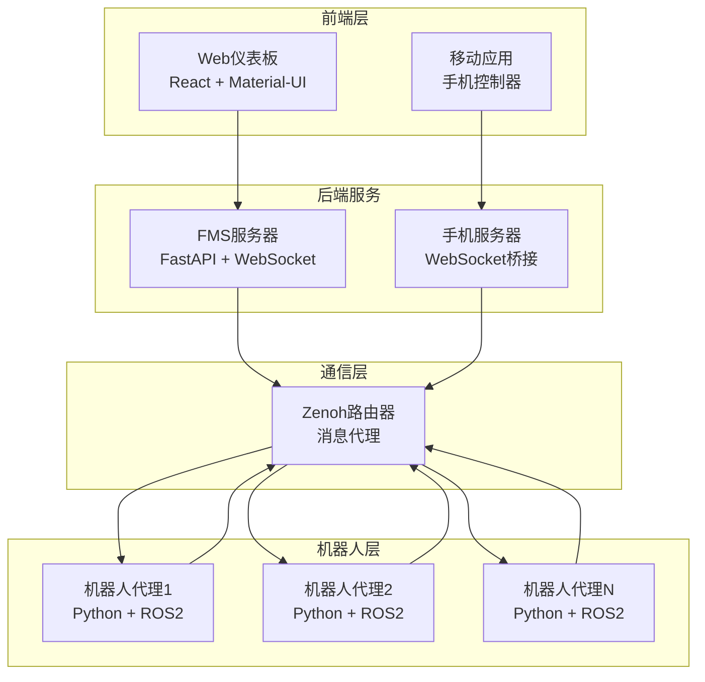

# 机器人车队管理系统 (FMS)

一个全面的机器人车队管理系统，能够实现多台机器人的实时监控、控制和任务调度。该系统使用Zenoh作为分布式消息传递协议，并提供Web和移动端界面进行机器人管理。

## 📋 目录

- [概述](#概述)
- [架构](#架构)
- [组件](#组件)
- [快速开始](#快速开始)
- [安装](#安装)
- [配置](#配置)
- [API文档](#api文档)
- [开发](#开发)
- [部署](#部署)
- [故障排除](#故障排除)

## 🎯 概述

FMS旨在管理和协调各种环境中的自主机器人车队。它提供：

- **实时监控** 机器人状态、位置和电池电量
- **任务调度和分发** 给可用的机器人
- **基于Web的仪表板** 用于车队可视化和控制
- **移动应用集成** 进行远程机器人控制
- **分布式消息传递** 使用Zenoh协议
- **可扩展架构** 支持多台机器人和客户端

## 🏗️ 架构



### 关键组件

1. **FMS服务器**: 处理任务调度和机器人状态管理的中央协调服务
2. **机器人代理**: 与ROS2接口并向FMS报告的个体机器人控制器
3. **Web前端**: 用于车队监控和控制的React仪表板
4. **手机服务器**: 直接机器人遥操作的移动端接口
5. **Zenoh路由器**: 分布式消息传递基础设施

## 🚀 组件

### 1. FMS服务器 (`/server`)

使用FastAPI构建的中央协调服务。

**功能:**
- 机器人状态管理和监控
- 任务调度和分发
- WebSocket实时更新
- 机器人操作的RESTful API
- 自动离线机器人检测

**主要文件:**
- `main.py`: 主服务器应用程序
- `config.json`: 服务器配置
- `run_server.sh`: 服务器启动脚本

### 2. 机器人代理 (`/agent`)

连接ROS2和FMS的Python机器人控制器。

**功能:**
- ROS2集成用于机器人控制
- 与FMS服务器的Zenoh通信
- 任务执行和状态报告
- 无ROS2测试的模拟接口
- 可配置的机器人识别

**主要文件:**
- `robot_agent.py`: 主代理实现
- `config.json`: 代理配置
- `build_docker.sh`: Docker容器化

### 3. Web前端 (`/front`)

用于车队管理的现代React仪表板。

**功能:**
- 实时机器人状态可视化
- 交互式任务创建和管理
- Material-UI响应式设计
- 实时更新的WebSocket集成
- 基于路由的导航

**主要文件:**
- `src/App.js`: 主应用组件
- `src/store/robotStore.js`: Zustand状态管理
- `src/components/`: UI组件
- `package.json`: 依赖项和脚本

### 4. 手机服务器 (`/phone_server`)

移动设备集成的WebSocket服务器。

**功能:**
- 移动设备输入处理
- Zenoh消息发布
- 实时遥操作支持
- 方向和位置控制
- 按钮和开关状态处理

**主要文件:**
- `phone_server.py`: 主服务器实现
- `run_server.sh`: 服务器启动脚本

### 5. Zenoh基础设施 (`/zenoh-server`)

分布式通信的消息代理配置。

**功能:**
- 基于Docker的部署
- 持久消息路由
- 多客户端支持
- 可配置端点

## ⚡ 快速开始

### 先决条件

- Python 3.8+
- Node.js 16+
- Docker和Docker Compose
- ROS2（可选，用于真实机器人）

### 1. 启动Zenoh路由器

```bash
cd zenoh-server
docker-compose up -d
```

### 2. 启动FMS服务器

```bash
cd server
python main.py
```

### 3. 启动Web前端

```bash
cd front
npm install
npm start
```

### 4. 启动机器人代理（测试）

```bash
cd agent
python robot_agent.py --interface mock
```

系统将在以下地址可用：
- Web仪表板: http://localhost:3000
- FMS API: http://localhost:8088
- Zenoh路由器: tcp://localhost:7447

## 📦 安装

### 系统依赖

```bash
# Ubuntu/Debian
sudo apt update
sudo apt install python3-pip nodejs npm docker.io docker-compose

# macOS
brew install python3 node docker
```

### Python依赖

```bash
# FMS服务器
cd server
pip install fastapi uvicorn websockets zenoh pydantic

# 机器人代理
cd ../agent
pip install zenoh rospy  # rospy仅在使用ROS2时需要

# 手机服务器
cd ../phone_server
pip install websockets numpy zenoh
```

### 前端依赖

```bash
cd front
npm install
```

## ⚙️ 配置

### 服务器配置 (`server/config.json`)

```json
{
    "zenoh_server_endpoint": "tcp/127.0.0.1:7447"
}
```

### 代理配置 (`agent/config.json`)

```json
{
    "zenoh_server_endpoint": "tcp/127.0.0.1:7447"
}
```

### 环境变量

```bash
# 前端
REACT_APP_BACKEND_PORT=8088

# 机器人代理
ROBOT_ID=robot-001  # 每个机器人的唯一标识符
```

## 📚 API文档

### REST端点

#### 获取所有机器人
```http
GET /api/robots
```

**响应:**
```json
[
    {
        "robot_id": "robot-001",
        "pose": {"position": {"x": 0, "y": 0, "z": 0}},
        "battery": 85.5,
        "status": "ONLINE",
        "last_seen": 1640995200.0
    }
]
```

#### 获取特定机器人
```http
GET /api/robots/{robot_id}
```

#### 创建任务
```http
POST /api/tasks
Content-Type: application/json

{
    "robot_id": "robot-001",
    "target_position": {"x": 10.0, "y": 5.0, "z": 0.0},
    "priority": "normal"
}
```

**响应:**
```json
{
    "task_id": "task_1640995200",
    "robot_id": "robot-001",
    "status": "scheduled"
}
```

#### 取消任务
```http
POST /api/robots/{robot_id}/cancel
```

### WebSocket事件

#### 状态更新
```json
{
    "msg_type": "state_update",
    "robot_id": "robot-001",
    "state_type": "pose",
    "data": {"position": {"x": 1.0, "y": 2.0, "z": 0.0}},
    "timestamp": 1640995200.0
}
```

#### 心跳
```json
{
    "msg_type": "heartbeat",
    "timestamp": 1640995200.0
}
```

### Zenoh主题

#### 机器人状态发布
- `fms/robot/{robot_id}/state/pose`: 机器人位置和方向
- `fms/robot/{robot_id}/state/battery`: 电池状态
- `fms/robot/{robot_id}/state/status`: 机器人操作状态
- `fms/robot/{robot_id}/heartbeat`: 定期心跳

#### 机器人命令订阅
- `fms/robot/{robot_id}/cmd/task`: 任务分配
- `fms/robot/{robot_id}/cmd/cancel`: 任务取消

#### 系统事件
- `fms/system/event/robot_offline`: 机器人断开通知

## 💻 开发

### 开发模式运行

#### 自动重载启动所有服务:

```bash
# 终端1 - Zenoh路由器
cd zenoh-server && docker-compose up

# 终端2 - FMS服务器
cd server && python main.py

# 终端3 - 前端
cd front && npm start

# 终端4 - 测试机器人
cd agent && python robot_agent.py --interface mock
```

### 代码结构

```
fms/
├── agent/                  # 机器人代理实现
│   ├── robot_agent.py     # 主代理代码
│   ├── config.json        # 代理配置
│   └── build_docker.sh    # Docker构建脚本
├── front/                  # React前端
│   ├── src/
│   │   ├── components/    # React组件
│   │   ├── store/         # 状态管理
│   │   └── App.js         # 主应用组件
│   └── package.json       # 依赖项
├── phone_server/          # 移动端接口服务器
│   └── phone_server.py    # WebSocket服务器
├── server/                # FMS主服务器
│   ├── main.py           # FastAPI应用程序
│   └── config.json       # 服务器配置
└── zenoh-server/          # 消息代理
    └── docker-compose.yml # Zenoh路由器设置
```

### 添加新功能

1. **新机器人命令**: 在`robot_agent.py`中添加处理器，在`server/main.py`中添加相应的API端点
2. **前端组件**: 在`front/src/components/`中创建新的React组件
3. **API端点**: 在`server/main.py`中扩展FastAPI路由
4. **机器人接口**: 在`agent/robot_agent.py`中实现新的机器人接口

## 🐳 部署

### Docker部署

#### 构建镜像

```bash
# 构建FMS服务器
cd server
docker build -t fms-server .

# 构建机器人代理
cd ../agent
docker build -t robot-agent .

# 构建手机服务器
cd ../phone_server
docker build -t phone-server .
```

#### 生产部署

```bash
# 启动基础设施
cd zenoh-server
docker-compose up -d

# 部署服务（示例）
docker run -d --name fms-server -p 8088:8088 fms-server
docker run -d --name robot-agent-1 -e ROBOT_ID=robot-001 robot-agent
docker run -d --name phone-server -p 8765:8765 phone-server
```

### 环境特定配置

#### 生产环境
```json
{
    "zenoh_server_endpoint": "tcp/production-zenoh:7447"
}
```

#### 开发环境
```json
{
    "zenoh_server_endpoint": "tcp/localhost:7447"
}
```

## 🔧 故障排除

### 常见问题

#### 1. Zenoh连接失败
```
错误: 无法连接到Zenoh路由器
```
**解决方案:**
- 验证Zenoh路由器正在运行: `docker ps | grep zenoh`
- 检查`config.json`中的端点配置
- 确保端口7447未被防火墙阻止

#### 2. WebSocket连接错误
```
错误: WebSocket连接失败
```
**解决方案:**
- 验证FMS服务器在端口8088上运行
- 检查浏览器控制台的详细错误消息
- 确保CORS配置正确

#### 3. 机器人代理未出现
```
机器人代理启动但未在仪表板中显示
```
**解决方案:**
- 检查Zenoh主题发布: 机器人应发布到`fms/robot/{id}/heartbeat`
- 验证robot_id是唯一的
- 检查服务器日志的状态更新处理

#### 4. ROS2集成问题
```
ImportError: No module named 'rospy'
```
**解决方案:**
- 测试时使用模拟接口: `--interface mock`
- 为生产机器人安装ROS2依赖项
- 验证ROS2环境变量已设置

### 调试模式

启用详细日志记录:

```bash
# FMS服务器
cd server
python main.py --log-level debug

# 机器人代理
cd agent
python robot_agent.py --interface mock --log-level debug
```

### 性能监控

监控系统性能:
- Zenoh消息吞吐量
- WebSocket连接数
- 机器人响应时间
- 电池电量和连接性

## 📄 许可证

本项目采用MIT许可证 - 详情请参阅LICENSE文件。

## 🤝 贡献

1. Fork仓库
2. 创建功能分支
3. 进行更改
4. 如适用，添加测试
5. 提交拉取请求

## 📞 支持

如有问题和支持：
- 在仓库中创建issue
- 查看故障排除部分
- 查看API文档

## 🌐 语言版本

- [English](README.md) - 英文版本
- [中文](README_zh.md) - 中文版本（当前文档）

---

**注意:** 此系统专为研究和开发目的而设计。对于生产部署，应实施额外的安全性、监控和可靠性措施。