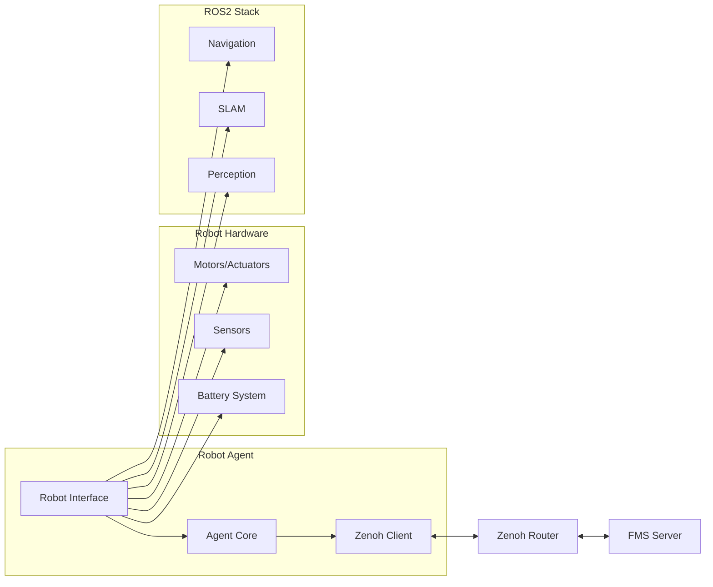

# Robot Agent Documentation

The Robot Agent is the client-side component that runs on each robot, providing the interface between the FMS server and the robot's hardware/ROS2 systems.

## Overview

The Robot Agent serves as a bridge between:
- **FMS Server**: Receives tasks and sends status updates
- **Robot Hardware**: Controls movement, reads sensors
- **ROS2 System**: Integrates with existing robot software stack

## Architecture



## Core Components

### 1. Robot Interface Abstraction

The agent uses an abstract interface pattern to support different robot types:

```python
class RobotInterface(ABC):
    @abstractmethod
    def get_pose(self): pass
    
    @abstractmethod
    def get_battery_state(self): pass
    
    @abstractmethod
    def send_velocity_command(self, linear_x, angular_z): pass
    
    @abstractmethod
    def get_current_time(self): pass
    
    @abstractmethod
    def is_shutdown(self): pass
```

### 2. ROS2 Integration (`ROSRobotInterface`)

Production implementation for ROS2-based robots:

**Subscribed Topics:**
- `/amcl_pose`: Robot localization from AMCL
- `/battery_state`: Battery status information

**Published Topics:**
- `/cmd_vel`: Velocity commands for robot movement

**Features:**
- Real-time pose updates from AMCL
- Battery monitoring and reporting
- Direct velocity control integration
- ROS2 lifecycle management

### 3. Mock Interface (`MockRobotInterface`)

Testing implementation for development without hardware:

**Capabilities:**
- Simulated pose with gradual position changes
- Mock battery state with realistic values
- Logging of velocity commands
- Controllable shutdown for testing

### 4. Zenoh Communication

#### Published Topics

**Robot State Updates:**
```
fms/robot/{robot_id}/state/pose
```
```json
{
    "position": {"x": 1.5, "y": 2.3, "z": 0.0},
    "orientation": {"x": 0.0, "y": 0.0, "z": 0.1, "w": 0.99},
    "timestamp": 1640995200.0
}
```

**Battery Status:**
```
fms/robot/{robot_id}/state/battery
```
```json
{
    "voltage": 12.4,
    "percentage": 85.5,
    "power_supply_status": 3,
    "timestamp": 1640995200.0
}
```

**Robot Status:**
```
fms/robot/{robot_id}/state/status
```
```json
{
    "status": "IDLE",
    "message": "Ready for tasks",
    "timestamp": 1640995200.0
}
```

**Heartbeat:**
```
fms/robot/{robot_id}/heartbeat
```
```json
{
    "status": "RUNNING",
    "timestamp": 1640995200.0
}
```

#### Subscribed Topics

**Task Commands:**
```
fms/robot/{robot_id}/cmd/task
```
```json
{
    "task_id": "task_1640995200",
    "target_position": {"x": 10.0, "y": 5.0, "z": 0.0},
    "priority": "normal",
    "timestamp": 1640995200.0
}
```

**Cancel Commands:**
```
fms/robot/{robot_id}/cmd/cancel
```
```json
{
    "timestamp": 1640995200.0,
    "reason": "user_request"
}
```

## Task Execution

### Task Lifecycle

1. **Task Reception**: Agent receives task via Zenoh
2. **Validation**: Check task parameters and robot readiness
3. **Execution**: Begin navigation to target position
4. **Monitoring**: Continuous status updates during execution
5. **Completion**: Report final status to FMS server

### Status States

- **IDLE**: Robot ready for new tasks
- **RUNNING**: Currently executing a task
- **COMPLETED**: Task finished successfully
- **CANCELLED**: Task stopped by user or system
- **ERROR**: Task failed due to error condition

### Example Task Execution

```python
def execute_task(self, task_data):
    """Execute task command with proper status reporting"""
    try:
        # Update status to running
        self.update_status('RUNNING', f'Executing task: {task_data["task_id"]}')
        
        # Extract task parameters
        target_pos = task_data["target_position"]
        priority = task_data.get("priority", "normal")
        
        # Execute navigation (implementation dependent)
        self.navigate_to_position(target_pos)
        
        # Report completion
        self.update_status('COMPLETED', f'Task {task_data["task_id"]} completed')
        
    except Exception as e:
        self.update_status('ERROR', f'Task failed: {str(e)}')
```

## Configuration

### Robot Identification

Robots are identified by unique IDs:
```python
def _get_robot_id(self):
    # Try environment variable first
    return os.getenv('ROBOT_ID', str(uuid.uuid4()))
```

**Environment Variable:**
```bash
export ROBOT_ID=robot-001
```

### Zenoh Configuration

**Configuration File (`config.json`):**
```json
{
    "zenoh_server_endpoint": "tcp/127.0.0.1:7447"
}
```

**Connection Setup:**
```python
self.zenoh_config = zenoh.Config()
self.zenoh_config.insert_json5('connect/endpoints', 
                               json.dumps([endpoint]))
self.session = zenoh.open(self.zenoh_config)
```

## Deployment

### Development Mode

**With ROS2:**
```bash
cd agent
source /opt/ros/humble/setup.bash  # or appropriate ROS2 version
python robot_agent.py --interface ros
```

**Without ROS2 (Testing):**
```bash
cd agent
python robot_agent.py --interface mock
```

### Production Mode

**Service Configuration (`/etc/systemd/system/robot-agent.service`):**
```ini
[Unit]
Description=Robot Agent for FMS
After=network.target

[Service]
Type=simple
User=robot
WorkingDirectory=/opt/robot-agent
Environment=ROBOT_ID=robot-001
Environment=ROS_DOMAIN_ID=42
ExecStart=/usr/bin/python3 robot_agent.py
Restart=always
RestartSec=5

[Install]
WantedBy=multi-user.target
```

**Enable Service:**
```bash
sudo systemctl enable robot-agent
sudo systemctl start robot-agent
```

### Docker Deployment

**Dockerfile:**
```dockerfile
FROM ros:humble-ros-base

# Install Python dependencies
RUN pip3 install zenoh

# Copy agent code
COPY robot_agent.py /app/
COPY config.json /app/

WORKDIR /app

# Set robot ID via environment
ENV ROBOT_ID=robot-001

CMD ["python3", "robot_agent.py"]
```

**Build and Run:**
```bash
docker build -t robot-agent .
docker run -e ROBOT_ID=robot-001 robot-agent
```

## ROS2 Integration Details

### Required ROS2 Packages

```xml
<!-- package.xml -->
<depend>rclpy</depend>
<depend>geometry_msgs</depend>
<depend>sensor_msgs</depend>
<depend>nav_msgs</depend>
```

### Topic Mapping

| ROS2 Topic | Message Type | Purpose |
|------------|--------------|---------|
| `/amcl_pose` | `geometry_msgs/PoseWithCovarianceStamped` | Robot localization |
| `/battery_state` | `sensor_msgs/BatteryState` | Power management |
| `/cmd_vel` | `geometry_msgs/Twist` | Movement commands |
| `/odom` | `nav_msgs/Odometry` | Wheel odometry (optional) |

### Navigation Integration

For advanced navigation, integrate with Nav2:

```python
def navigate_to_position(self, target_position):
    """Navigate to target using Nav2 action client"""
    from nav2_msgs.action import NavigateToPose
    
    # Create goal
    goal = NavigateToPose.Goal()
    goal.pose.header.frame_id = "map"
    goal.pose.pose.position.x = target_position["x"]
    goal.pose.pose.position.y = target_position["y"]
    
    # Send goal and wait for result
    self.nav_client.send_goal_async(goal)
```

## Error Handling

### Common Error Scenarios

1. **Zenoh Connection Loss**
   ```python
   try:
       self.session.put(topic, data)
   except Exception as e:
       logger.error(f"Failed to publish: {e}")
       # Attempt reconnection
       self.reconnect_zenoh()
   ```

2. **ROS2 Node Failures**
   ```python
   def is_shutdown(self):
       try:
           return self.rospy.is_shutdown()
       except Exception:
           logger.error("ROS2 shutdown check failed")
           return True
   ```

3. **Task Execution Failures**
   ```python
   def execute_task(self, task_data):
       try:
           # Task execution logic
           pass
       except Exception as e:
           self.update_status('ERROR', str(e))
           logger.error(f"Task execution failed: {e}")
   ```

### Recovery Strategies

- **Automatic Reconnection**: Zenoh connection recovery
- **Graceful Degradation**: Continue basic operation during failures
- **Status Reporting**: Always report current state to FMS
- **Safe Shutdown**: Proper cleanup on termination

## Performance Optimization

### Update Frequencies

- **Pose Updates**: 1 Hz (configurable)
- **Battery Updates**: 0.1 Hz (every 10 seconds)
- **Heartbeat**: 1 Hz
- **Status Updates**: Event-driven

### Resource Usage

- **Memory**: ~20MB typical usage
- **CPU**: <5% on single core
- **Network**: ~1KB/s per robot

### Optimization Tips

1. **Reduce Update Frequency**: Lower frequencies for non-critical data
2. **Message Compression**: Use compact JSON formats
3. **Connection Pooling**: Reuse Zenoh connections
4. **Async Operations**: Non-blocking I/O for all network operations

## Testing

### Unit Tests

```python
import unittest
from robot_agent import MockRobotInterface

class TestRobotAgent(unittest.TestCase):
    def setUp(self):
        self.interface = MockRobotInterface()
        self.agent = RobotAgent(self.interface)
    
    def test_task_execution(self):
        task = {
            "task_id": "test_task",
            "target_position": {"x": 1.0, "y": 1.0, "z": 0.0}
        }
        self.agent.execute_task(task)
        self.assertEqual(self.agent.status, 'COMPLETED')
```

### Integration Tests

```bash
# Start test environment
cd agent
python robot_agent.py --interface mock &

# Verify Zenoh communication
zenoh scout
zenoh subscriber "fms/robot/*/heartbeat"
```

### Simulation Testing

Use Gazebo or other simulators:
```bash
# Launch robot simulation
ros2 launch robot_simulation robot.launch.py

# Start agent with ROS interface
python robot_agent.py --interface ros
```

## Troubleshooting

### Common Issues

1. **Agent Not Appearing in FMS**
   - Check Zenoh connectivity
   - Verify robot_id uniqueness
   - Review topic naming convention

2. **ROS2 Topics Not Found**
   - Verify ROS2 environment setup
   - Check topic names and types
   - Ensure navigation stack is running

3. **High CPU Usage**
   - Check update frequencies
   - Review callback efficiency
   - Monitor message sizes

### Debug Commands

```bash
# Check ROS2 topics
ros2 topic list
ros2 topic echo /amcl_pose

# Monitor Zenoh traffic
zenoh scout
zenoh subscriber "fms/robot/**"

# View agent logs
journalctl -u robot-agent -f
```

### Log Analysis

Important log messages to monitor:
```
INFO: Robot agent started with ID: robot-001
INFO: Connected to Zenoh successfully
INFO: Subscribed to command topics
WARNING: Battery level low: 15%
ERROR: Navigation goal failed
```

## Security Considerations

### Current Implementation
- No authentication for Zenoh communication
- Plain text message transmission
- Open command reception

### Production Recommendations
1. **Message Authentication**: Sign critical commands
2. **Encrypted Communication**: Use TLS for Zenoh
3. **Command Validation**: Strict input validation
4. **Access Control**: Limit command sources
5. **Audit Logging**: Complete command history

---

For more information, see the main [README.md](../README.md) or [server documentation](server.md).