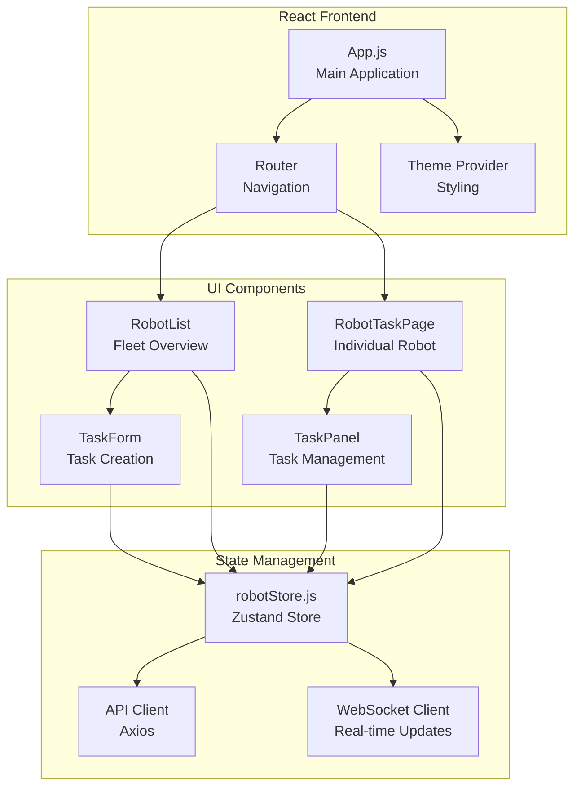

# Frontend Documentation

The FMS Frontend is a modern React-based web application that provides a comprehensive dashboard for monitoring and controlling robot fleets in real-time.

## Overview

The frontend application offers:
- **Real-time robot monitoring** with live status updates
- **Interactive task management** for robot coordination
- **Responsive Material-UI design** for desktop and mobile
- **WebSocket integration** for instant data synchronization
- **State management** using Zustand for efficient data flow

## Technology Stack

### Core Technologies
- **React 18**: Modern React with hooks and concurrent features
- **Material-UI (MUI) 5**: Component library for professional UI
- **Zustand**: Lightweight state management
- **React Router**: Client-side routing
- **Axios**: HTTP client for API communication
- **WebSocket**: Real-time communication

### Dependencies
```json
{
  "@emotion/react": "^11.11.1",
  "@emotion/styled": "^11.11.0", 
  "@mui/icons-material": "^5.14.18",
  "@mui/material": "^5.14.18",
  "axios": "^1.6.1",
  "react": "^18.2.0",
  "react-dom": "^18.2.0",
  "react-router-dom": "^7.6.2",
  "zustand": "^4.4.6"
}
```

## Application Architecture



## Component Structure

### 1. Main Application (`App.js`)

The root component that sets up the application structure:

```javascript
const App = () => {
  const { initRobots, connectWebSocket, error, isWebSocketConnected } = useRobotStore();

  useEffect(() => {
    initRobots();        // Load initial robot data
    connectWebSocket();  // Establish real-time connection
  }, []);

  return (
    <Router>
      <ThemeProvider theme={theme}>
        {/* Application content */}
      </ThemeProvider>
    </Router>
  );
};
```

**Key Features:**
- Application initialization and lifecycle management
- Global error handling and display
- WebSocket connection status monitoring
- Responsive theme configuration

### 2. Robot List (`RobotList.js`)

Fleet overview component displaying all robots:

```javascript
const RobotList = ({ robots }) => {
  const navigate = useNavigate();
  
  const handleCardClick = (robotId) => {
    navigate(`/robot/${robotId}`);
  };

  return (
    <Grid container spacing={3}>
      {robots.map(robot => (
        <RobotCard key={robot.id} robot={robot} onClick={handleCardClick} />
      ))}
    </Grid>
  );
};
```

**Features:**
- Grid layout with responsive cards
- Real-time status indicators
- Battery level visualization
- Quick task cancellation
- Navigation to individual robot pages

### 3. Robot Task Page (`RobotTaskPage.js`)

Detailed view for individual robot management:

```javascript
const RobotTaskPage = () => {
  const { robotId } = useParams();
  const robot = useRobotStore(state => state.getRobotById(robotId));
  
  return (
    <Grid container spacing={3}>
      <Grid item xs={12} md={6}>
        <RobotDetails robot={robot} />
      </Grid>
      <Grid item xs={12} md={6}>
        <TaskManagement robotId={robotId} />
      </Grid>
    </Grid>
  );
};
```

**Features:**
- Detailed robot information display
- Task creation and management interface
- Real-time status monitoring
- Historical task information

### 4. State Management (`robotStore.js`)

Centralized state management using Zustand:

```javascript
const useRobotStore = create((set, get) => ({
  robots: {},
  isWebSocketConnected: false,
  error: null,
  
  // Initialize robot data from API
  initRobots: async () => {
    try {
      const response = await axios.get('/api/robots');
      const robots = response.data.reduce((acc, robot) => {
        acc[robot.robot_id] = robot;
        return acc;
      }, {});
      set({ robots, error: null });
    } catch (err) {
      set({ error: 'Failed to fetch robot data' });
    }
  },
  
  // Establish WebSocket connection for real-time updates
  connectWebSocket: () => {
    const ws = new WebSocket('ws://localhost:8088/ws');
    
    ws.onmessage = (event) => {
      const update = JSON.parse(event.data);
      // Handle real-time robot updates
      updateRobotState(update);
    };
  }
}));
```

## Real-time Features

### WebSocket Integration

The application maintains a persistent WebSocket connection for real-time updates:

**Connection Management:**
```javascript
connectWebSocket: () => {
  const ws = new WebSocket(`${wsProtocol}//${wsHost}:${wsPort}/ws`);
  
  ws.onopen = () => {
    set({ isWebSocketConnected: true });
  };
  
  ws.onmessage = (event) => {
    const update = JSON.parse(event.data);
    handleRealTimeUpdate(update);
  };
  
  ws.onclose = () => {
    set({ isWebSocketConnected: false });
    setTimeout(get().connectWebSocket, 3000); // Auto-reconnect
  };
};
```

**Update Processing:**
```javascript
const handleRealTimeUpdate = (update) => {
  const { robot_id, msg_type, state_type, data } = update;
  
  switch (msg_type) {
    case 'state_update':
      updateRobotState(robot_id, state_type, data);
      break;
    case 'heartbeat':
      // Connection keepalive
      break;
    default:
      console.warn('Unknown message type:', msg_type);
  }
};
```

### Live Status Indicators

Visual indicators provide immediate feedback on robot status:

```javascript
const getStatusIcon = (status) => {
  switch (status) {
    case 'ONLINE': return <CheckCircle color="success" />;
    case 'OFFLINE': return <Error color="error" />;
    case 'BUSY': return <Warning color="warning" />;
    default: return <Error color="default" />;
  }
};

const getBatteryIcon = (level) => {
  if (level >= 75) return <BatteryFull color="success" />;
  if (level >= 50) return <Battery50 color="success" />;
  if (level >= 20) return <Battery20 color="warning" />;
  return <BatteryAlert color="error" />;
};
```

## UI Components

### Robot Status Card

```javascript
const RobotCard = ({ robot, onClick }) => (
  <Card onClick={() => onClick(robot.id)} sx={{ cursor: 'pointer' }}>
    <CardHeader
      avatar={<Avatar>{getStatusIcon(robot.status)}</Avatar>}
      title={robot.robot_id}
      subheader={`Last update: ${formatTimestamp(robot.last_seen)}`}
    />
    <CardContent>
      <Box sx={{ display: 'flex', alignItems: 'center', mb: 2 }}>
        {getBatteryIcon(robot.battery)}
        <Typography variant="body2" sx={{ ml: 1 }}>
          Battery: {robot.battery?.toFixed(1)}%
        </Typography>
      </Box>
      <Chip
        label={robot.status}
        color={getStatusColor(robot.status)}
        size="small"
      />
    </CardContent>
  </Card>
);
```

### Task Creation Form

```javascript
const TaskForm = ({ robotId, onSubmit }) => {
  const [position, setPosition] = useState({ x: 0, y: 0, z: 0 });
  const [priority, setPriority] = useState('normal');
  
  const handleSubmit = (e) => {
    e.preventDefault();
    onSubmit({
      robot_id: robotId,
      target_position: position,
      priority: priority
    });
  };
  
  return (
    <form onSubmit={handleSubmit}>
      <TextField
        label="X Position"
        type="number"
        value={position.x}
        onChange={(e) => setPosition({...position, x: parseFloat(e.target.value)})}
      />
      {/* Additional form fields */}
      <Button type="submit" variant="contained">
        Send Task
      </Button>
    </form>
  );
};
```

## Theme and Styling

### Material-UI Theme Configuration

```javascript
const theme = createTheme({
  palette: {
    mode: 'light',
    primary: {
      main: '#2196f3',
      light: '#e3f2fd',
      dark: '#1976d2'
    },
    secondary: {
      main: '#9c27b0',
      light: '#e1bee7', 
      dark: '#7b1fa2'
    },
    background: {
      default: '#d0d0d0',
      paper: '#e8e8e8'
    }
  },
  components: {
    MuiCard: {
      styleOverrides: {
        root: {
          boxShadow: '0 4px 12px rgba(0,0,0,0.06)',
          borderRadius: '8px'
        }
      }
    }
  }
});
```

### Responsive Design

The application adapts to different screen sizes:

```javascript
// Grid breakpoints for responsive layout
<Grid container spacing={3}>
  <Grid item xs={12} sm={6} md={4}>
    {/* Robot cards adapt to screen size */}
  </Grid>
</Grid>

// Responsive typography
<Typography 
  variant="h4" 
  sx={{ 
    fontSize: { xs: '1.5rem', md: '2rem' },
    display: { xs: 'none', sm: 'block' }
  }}
>
  Fleet Management System
</Typography>
```

## API Integration

### HTTP Requests

```javascript
// Fetch initial robot data
const initRobots = async () => {
  try {
    const response = await axios.get(`${backendBaseUrl}/api/robots`);
    const robots = response.data.reduce((acc, robot) => {
      acc[robot.robot_id] = robot;
      return acc;
    }, {});
    set({ robots, error: null });
  } catch (err) {
    set({ error: 'Failed to fetch initial robot data' });
  }
};

// Send task to robot
const sendTask = async (taskData) => {
  try {
    const response = await axios.post('/api/tasks', taskData);
    const newTask = response.data;
    set(state => ({
      tasks: [...state.tasks, newTask]
    }));
    return newTask;
  } catch (err) {
    const errorMsg = err.response?.data?.detail || 'Failed to send task';
    set({ error: errorMsg });
    throw new Error(errorMsg);
  }
};

// Cancel robot task
const cancelTask = async (robotId) => {
  try {
    await axios.post(`/api/robots/${robotId}/cancel`);
    set(state => ({
      tasks: state.tasks.map(task => 
        task.robot_id === robotId ? { ...task, status: 'cancelled' } : task
      )
    }));
  } catch (err) {
    const errorMsg = err.response?.data?.detail || 'Failed to cancel task';
    set({ error: errorMsg });
    throw new Error(errorMsg);
  }
};
```

### Error Handling

```javascript
// Global error handling in store
const clearError = () => set({ error: null });

// Component-level error display
{error && (
  <Alert 
    severity="error" 
    onClose={() => useRobotStore.getState().clearError()}
    sx={{ mb: 3 }}
  >
    {error}
  </Alert>
)}
```

## Development Setup

### Installation

```bash
cd front
npm install
```

### Development Server

```bash
npm start
# Application runs on http://localhost:3000
```

### Environment Configuration

Create `.env` file for environment-specific settings:
```bash
REACT_APP_BACKEND_PORT=8088
REACT_APP_BACKEND_HOST=localhost
REACT_APP_WS_PROTOCOL=ws
```

### Build for Production

```bash
npm run build
# Creates optimized build in ./build directory
```

## Testing

### Component Testing

```javascript
import { render, screen } from '@testing-library/react';
import RobotList from './RobotList';

test('renders robot cards', () => {
  const mockRobots = [
    { id: 'robot-001', status: 'ONLINE', battery: 85 }
  ];
  
  render(<RobotList robots={mockRobots} />);
  
  expect(screen.getByText('robot-001')).toBeInTheDocument();
  expect(screen.getByText('85%')).toBeInTheDocument();
});
```

### Integration Testing

```javascript
import { renderHook, act } from '@testing-library/react-hooks';
import useRobotStore from './store/robotStore';

test('robot store updates correctly', async () => {
  const { result } = renderHook(() => useRobotStore());
  
  await act(async () => {
    await result.current.initRobots();
  });
  
  expect(Object.keys(result.current.robots)).toHaveLength(2);
});
```

## Deployment

### Static Hosting

```bash
# Build production bundle
npm run build

# Deploy to static hosting (Netlify, Vercel, etc.)
netlify deploy --prod --dir=build
```

### Docker Deployment

**Dockerfile:**
```dockerfile
FROM node:16-alpine as build

WORKDIR /app
COPY package*.json ./
RUN npm ci --only=production

COPY . .
RUN npm run build

FROM nginx:alpine
COPY --from=build /app/build /usr/share/nginx/html
COPY nginx.conf /etc/nginx/nginx.conf

EXPOSE 80
CMD ["nginx", "-g", "daemon off;"]
```

**nginx.conf:**
```nginx
server {
    listen 80;
    location / {
        root /usr/share/nginx/html;
        index index.html index.htm;
        try_files $uri $uri/ /index.html;
    }
    
    location /api {
        proxy_pass http://fms-server:8088;
        proxy_http_version 1.1;
        proxy_set_header Upgrade $http_upgrade;
        proxy_set_header Connection 'upgrade';
        proxy_set_header Host $host;
    }
    
    location /ws {
        proxy_pass http://fms-server:8088;
        proxy_http_version 1.1;
        proxy_set_header Upgrade $http_upgrade;
        proxy_set_header Connection "upgrade";
    }
}
```

## Performance Optimization

### Code Splitting

```javascript
import { lazy, Suspense } from 'react';

const RobotTaskPage = lazy(() => import('./components/RobotTaskPage'));

// In App.js
<Suspense fallback={<CircularProgress />}>
  <Routes>
    <Route path="/robot/:robotId" element={<RobotTaskPage />} />
  </Routes>
</Suspense>
```

### State Optimization

```javascript
// Selective state subscription to prevent unnecessary re-renders
const robots = useRobotStore(state => state.robots);
const isConnected = useRobotStore(state => state.isWebSocketConnected);

// Memoized selectors
const getRobotById = useCallback(
  (id) => useRobotStore.getState().robots[id],
  []
);
```

### Bundle Analysis

```bash
# Analyze bundle size
npm install --save-dev webpack-bundle-analyzer
npm run build
npx webpack-bundle-analyzer build/static/js/*.js
```

## Security Considerations

### Input Validation

```javascript
const validateTaskInput = (task) => {
  if (!task.robot_id || typeof task.robot_id !== 'string') {
    throw new Error('Invalid robot ID');
  }
  
  if (!task.target_position || 
      typeof task.target_position.x !== 'number' ||
      typeof task.target_position.y !== 'number') {
    throw new Error('Invalid target position');
  }
  
  return true;
};
```

### XSS Prevention

```javascript
// Safe HTML rendering
import DOMPurify from 'dompurify';

const SafeHTML = ({ html }) => (
  <div dangerouslySetInnerHTML={{ __html: DOMPurify.sanitize(html) }} />
);
```

### HTTPS/WSS Configuration

```javascript
// Automatic protocol detection
const protocol = window.location.protocol === 'https:' ? 'wss:' : 'ws:';
const wsUrl = `${protocol}//${window.location.host}/ws`;
```

## Troubleshooting

### Common Issues

1. **WebSocket Connection Failed**
   ```javascript
   // Check browser console for errors
   // Verify backend server is running
   // Check network connectivity
   ```

2. **Robot Data Not Loading**
   ```javascript
   // Check API endpoint availability
   // Verify CORS configuration
   // Review network requests in browser dev tools
   ```

3. **Real-time Updates Not Working**
   ```javascript
   // Verify WebSocket connection status
   // Check message format in browser console
   // Ensure proper state update handling
   ```

### Debug Tools

```javascript
// Enable debug logging
localStorage.setItem('debug', 'fms:*');

// Monitor state changes
useRobotStore.subscribe(
  (state) => console.log('State updated:', state)
);

// WebSocket message logging
ws.onmessage = (event) => {
  console.log('Received:', JSON.parse(event.data));
};
```

---

For more information, see the main [README.md](../README.md) or other component documentation.